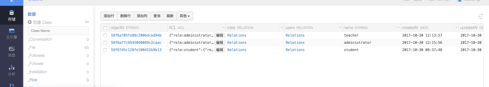

## 前端人员轻松实现后端服务的利器—— BaaS

> BaaS （区块链即服务：Blockchain as a Service）即区块链应用解决方案

作为一名前端、移动端开发人员，想要写个全栈demo或者带领一个初创团队开发一个项目要怎么做？

负载均衡，防火墙，IP映射，搭建环境，配置数据库，编写数据访问层...？绝对对能让前端人员写的怀疑人生。

找一个专门写服务器端和数据库的后端开发人员？人力成本高的吓人。

想要OAuth、手机号注册、消息推送？喵喵喵……

**这时候 BaaS 就孕育而生。**

### 什么是BaaS

> BaaS（Backend as a Service）是一种新型的云服务，旨在为移动和Web应用提供后端云服务，包括云端数据/文件存储、账户管理、消息推送、社交媒体整合等。BaaS是垂直领域的云服务，随着移动互联网的持续火热，BaaS也受到越来越多的开发者的亲睐。它作为应用开发的新模型，可以降低开发者成本，让开发者只需专注于具体的开发工作。

通俗的说，BaaS 就是集成了服务器端绝大多数功能的黑盒系统。使用图形界面的数据库架构设计和傻瓜式管理方式。通过api与前端通讯，让前端人员专注前端开发，轻松管理后端数据和服务。

### BaaS 有什么优势？

所有的前端开发人员都知道。前端变得越来越多样化，特别是前后端分离后。前端越来越不可或缺。

而对于一个初创的项目,用户数不多，这时候性能和稳定性并不是最主要的目标，把产品放到市场上去验证想法，快速试错才是这时候最主要的目标。
使用Bass能够实现产品快速开发、快速迭代、及时修生并有更小的试错成本，更有利于产品的前期市场化运作。

### 使用样例

以leancloud为例。所有的后端逻辑与数据相关的都可以放在leancloud上，存储、消息推送、数据存储、实时通讯、身份验证都能够通过函数调用轻松完成。
如最长后端人员头疼的用户注册的短信验证和邮箱验证，在 BaaS 上，只是一个函数调用的事情：

手机号注册
```javascript
AV.Cloud.requestSmsCode('13577778888').then(function (success) {
  }, function (error) {
  });
```

OAhth登录
```javascript
  AV.User.signUpOrlogInWithAuthData({
      // 微博（weibo）用 uid
      // 微信（weixin）和 QQ（qq）用 openid
      "openid": "oPrJ7uM5Y5oeypd0fyqQcKCaRv3o",
      "access_token": "OezXcEiiBSKSxW0eoylIeNFI3H7HsmxM7dUj1dGRl2dXJOeIIwD4RTW7Iy2IfJePh6jj7OIs1GwzG1zPn7XY_xYdFYvISeusn4zfU06NiA1_yhzhjc408edspwRpuFSqtYk0rrfJAcZgGBWGRp7wmA",
      "expires_at": "2016-01-06T11:43:11.904Z"
  }, 'weixin').then(function (s) {
  }, function (e) {

  });
```

注册后使用token登录
```javascript
AV.User.become(sessionToken).then(function(user) {
  })
```

还有最常见的数据存储
```javascript
  var query = new AV.Query('Todo');
  query.get('57328ca079bc44005c2472d0').then(function (todo) {
  }, function (error) {
  });
```

整个世界都变得美好了……

#### 另外！！！

图形界面的数据库管理界面和ACL也让人很优雅的设计管理后端数据架构。

无论是class的权限设置还是字段的数据类型、class之间的关系调用。都是在鼠标按动间轻松完成。

如：




我曾一度认为，有了 BaaS ，真的可以一个人全栈打天下（nodejs写的restful API服务器在墙角瑟瑟发抖）

### 极力推荐的Parse

[parse](http://parseplatform.org/#sdks)是由facebook收购后开源的 BaaS 服务。
Facebook的维护 + BSD协议，让不想依赖一些 BaaS 服务上或者有自己服务器的人也能轻松构建私有 BaaS 。

parse有支持多种平台的SDK或接口: iOS、 Android 、 JavaScript 、 .NET | Unity | PHP | Arduino | Embedded C | Cloud Code | REST API

parse同样也支持邮箱、手机号码验证，消息推送和实时推送等

最重要的还是其开源特性，能够让使用者轻松管理搭建适合自己的 BaaS

#### parse还有很多相关package

parse-dashboard （功能强大的dashboard, 除了数据管理和推送消息，还有相关的数据监控面板，同时支持多种用户访问dashboard权限设置）

ParseReact(虽然我并没有用到过)
